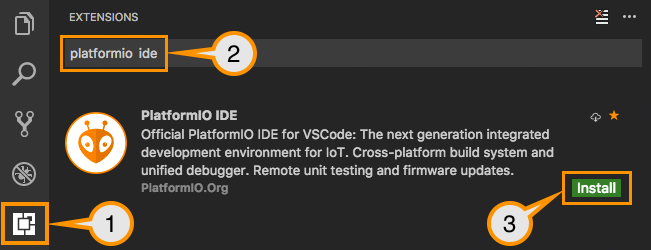
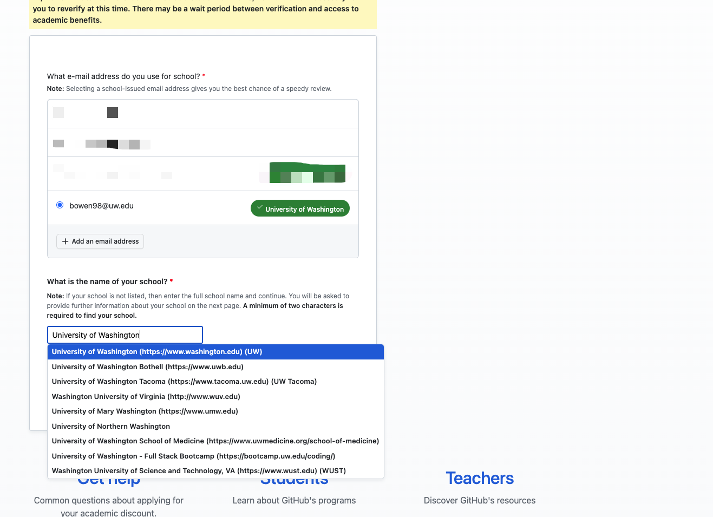
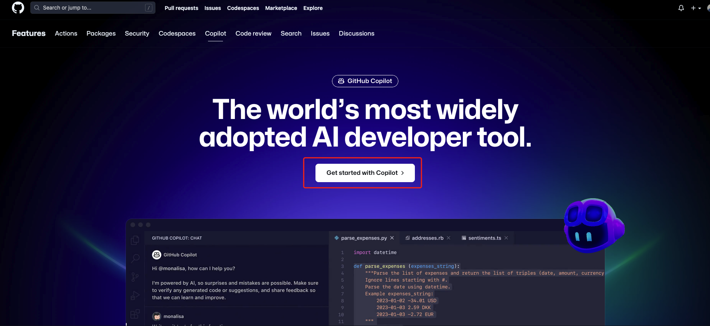
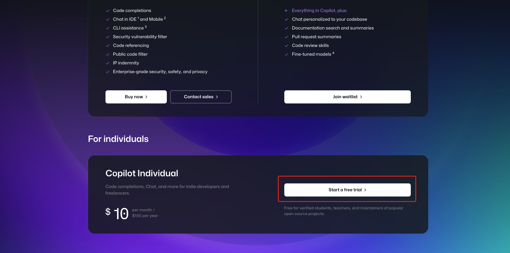

# Lab 1 : Introduction to Platform IO with XIAO Seeeduino SAMD21

# ****1. Introduction to Platform IO****

### **Before everything starts: why Platform IO?**

* Wider range of microcontrollers and development boards than Arduino IDE.
* More set of tools supporting Library Management, Continuous Integration, Unit Testing, and Debugging.
* Compatible with other VSCode extensions (e.g. GitHub Copilot).
  * We highly suggest you install GitHub Copilot extension on VSCode first before this lab. The instruction is here in the [appendix](#appendix:-github-copilot).

### **Lab Objectives**

In this lab, students will:

1. **Learn to Use PlatformIO for Project Management**: Gain practical skills in managing and organizing hardware/software lab projects using PlatformIO's advanced features.
2. **Create and Test a "Hello World" Project**: Develop a basic "Hello World" program in PlatformIO.
3. **Import and Modify an Existing Project**: Learn to import and work with an existing project, specifically focusing on the wearable device built in the previous quarter.

### **Lab Prerequisites**

Before we dive into Platform IO, ensure you have the following ready:

- **Visual Studio Code (VSCode)** installed on your Windows, MacOS, or Linux computer.
- **Your Wearable Device**: Make sure you have the wearable device you made last quarter. We'll be programming with it during this lab.
- **USB-C cable**: Make sure you can connect your wearable device to your laptop

### **Installing Platform IO**

- **Prerequisites**: Ensure Python is installed on your system.
- **Installation Steps**:

  1. Open VSCode, go to Extensions.
  2. Search for "PlatformIO IDE".
  3. Install the PlatformIO IDE extension.

  
- We highly recommend referring to the [Platform IO documentation](https://docs.platformio.org/en/latest/integration/ide/vscode.html#quick-start) and [tutorials](https://docs.platformio.org/en/latest/tutorials/index.html#tutorials). These resources contain detailed tutorials and comprehensive documentation for most boards you will need to use

### **Configuring the Development Environment**

- **Setting Up the IDE**: Once installed, open Platform IO from the VSCode sidebar. Initially, allow it to complete any additional installations or updates.
- **Adding Extensions and Plugins**: Explore the Extensions marketplace in VSCode for relevant add-ons
  - GitHub CoPilot (free for students on GitHub when registered with your UW ID)
  - Git integration
  - code linters
  - Arduino specific extensions

# 2. HELLO WORLD -  XIAO SAMD21

[Reference Tutorial](https://sigmdel.ca/michel/ha/xiao/seeeduino_xiao_platformio2_en.html)

## PlatformIO Prerequisites

Adding the PlatformIO extension in the editor is quite simple, just follow the [installation instructions](https://docs.platformio.org/en/latest/integration/ide/vscode.html#installation). Once PlatformIO is added, it adds a toolbar to the status bar at the bottom of the editor.


References to the **`Home`**, **`Build`**, **`Upload`** and **`Serial Monitor`** buttons will be made in what follows. The [toolbar documentation](https://docs.platformio.org/en/latest/integration/ide/vscode.html#id4) gives the keyboard shortcuts for these buttons.

The only hardware requirements is a free USB port on the desktop or portable computer to be used to download firmware to the XIAO or any other board and an appropriate USB cable to connect to the board. The XIAO requires a usb-c type cable.

## Installing the XIAO Board Definition


1. Go to the PIO home page by clicking on the house icon on the status bar at the bottom of the editor window. If the mouse hovers over the iconthen the hint identifies it as the PlatformIO: Home button.
2. Bring up the **`Board Explorer`** in PIO by clicking on the Boards icon in the left panel.
3. Enter **`seeduino`** or **`xiao`** in the **`Search Board...`** search box and press Enter.
4. Click on the **`Atmel SAM`** platform


1. Click on the **Install** button in the **`Atmel SAM`** page. Not surprisingly, this will install the platform.


A message box confirming the installation of the platform will pop up. Click on the **OK** button to close the message window.

And that completes the installation of a platform. PIO will know where to obtain the toolchain and will manage to download needed packages as needed. It is now possible to create a project for the XIAO.

## Create a Project


1. Go to the PIO home page by clicking on the PIO home button in the PIO toolbar on the status bar at the bottom of the editor window.
2. Go to the **`Projects`** page in PIO by clicking on the **`Projects`** icon in the left panel.
3. Bring up the **`Project Wizard`** in PIO by clicking on the **`+ Create New Project`** button in the top right of the **`Projects`** page.
4. Enter a project name in the **`Name`** field. Here I entered **`hello_xiao`**.
5. Select the **`Board`**. The full name is Seeeduino XIAO but you can enter a part of the name and a list of matching boards will be displayed in the drop-down list.
6. Click on the full board name in the list. Not visible in the above image, the **`Framework`** will automatically be set to Arduino.
7. Leaving **`Location`** checked will mean that the project will be saved in a directory called **`hello_xiao`** in the PIO projects directory. The default location of that folder is **`/home/*user*/Documents/PlatformIO/Projects`**.
8. If that location is acceptatble, click on the **Finish** button.

I prefer to group board specific projects in a directory named after the board.


1. I unchecked **Location**.
2. Then I clicked on the **`Projects`** directory in the **`Places`** section of teh left panel of the file explorer.
3. Then I clicked on the desired subdirectory named **`xiao`** which I had created previously. Otherwise I could have clicked on the **New** button to create the subdirectory.
4. Click on the **Finish** button.

This will create the project which consists of a number of directories and files that are displayed in the **`EXPLORER`** pane.


Two files are important at this juncture. The **`main.cpp`** source file in the **`.../hello_xiao/src/`** which contains the typical Arduino sketch structure. Note how PIO explicitely includes the **`Arduino.h`** header file in the project.


Check carefully the content of the project configuration file. For some reason my first project had the following content

```yaml
[env:seeeduino]
platform = atmelavr
board = seeeduino
framework = arduino
```

which is not correct. At this point, it is a good idea to add an entry setting the baud of the serial connection to the XIAO. The content of **`platformio.ini`** for a Seeeduino XIAO project should be:

```yaml
[env:seeed_xiao]
platform = atmelsam
board = seeed_xiao
framework = arduino
monitor_speed = 115200
```

see [Seeeduino](https://docs.platformio.org/en/latest/boards/atmelsam/seeed_xiao.html?utm_medium=piohome&utm_source=platformio) for details.

## Compile a Project


Let's put what is probably the simplest working XIAO program in **`main.cpp`**.

```cpp
*/*  hello_xiao    A first sketch for the Seeeduino XIAO in PlatformIO*
  
    *This example code is in the public domain.*
  
    *Michel Deslierres  June 15, 2020 */*
  
  **#include <Arduino.h>**  *// needed in PlatformIO*
  
  **void** setup() {
  }
  
  **void** loop() {
    Serial.println("Hello XIAO!");
    delay(2000);
  }
```

Click on the **`Build`** button of the PIO toolbar.


A terminal window will be opened in which the output from the compiler and linker will be displayed.


## Upload a Project


Once a project can be compiled without error, it is possible to upload the firmware to the XIAO. This is done by clicking on the **`PlatformIO: Upload`** icon on the status bar which is the right pointing arrow beside the home and compile icons. PIO should then reuse the terminal window to show the status of the upload and then to show the serial monitor with the XIAO output, if the upload was successful.


It may be necessary to manually start the serial monitor. The **`PlatformIO: Serial Monitor`** icon is the upward pointing plug on the status bar. Once the serial monitor is connected, the "Hello XIAO!" message from the board should be printed every second. The blue LED labeled T (for UART TX activity) will flash as the XIAO prints out it's message to the serial port.

Given the [double duty performed by the USB port of the XIAO](https://sigmdel.ca/michel/ha/xiao/seeeduino_xiao_01_en.html#download_problem), there is a good chance that PIO will fail at a first attempt to upload the firmware.


In that case ground the XIAO RST (reset) pad twice in quick succession and the board should then be in "bootloader" mode waiting for the new version of the firmware. When the XIAO is in this mode, it shows up as a storage device named Arduino as can be seen below.


Uploading will work when the XIAO is in this mode.

# Installing Display Libraries

Now that our Hello World project is setup lets try to use external libraries in PlatformIO. We will try to use the Arduino libraries for the SSD1306 OLED display.

## ****OLED Display SSD1306 Pin Wiring****

Because the OLED display uses I2C communication protocol, wiring is very simple. You can use the following table as a reference.

| Pin | SAMD21  |
| --- | ------- |
| Vin | 3.3V    |
| GND | GND     |
| SCL | GPIO 22 |
| SDA | GPIO 21 |

Alternatively, you can follow the next schematic diagram to wire the ESP32 to the OLED display.


Note : For the XIAO Seeduino SAMD21 boards the pin numbers 4 and 5 are SDA and SCL respectively


## ****Installing SSD1306 OLED and GFX Library****

Now navigate to the **`Libraries`** section in **`PIO Home`** and type “Adafruit GFX” in the search box.


You should be able to see the **`Adafruit GFX Library`** and the **`Adafruit SSD1306 Library`**

Install both the libraries by adding them to our project


Once added you should be able to see the library entries in the **`platform.ini`** file like this:

```cpp
[env:seeed_xiao]
platform = atmelsam
board = seeed_xiao
framework = arduino
lib_deps = 
	adafruit/Adafruit GFX Library@^1.11.9
	adafruit/Adafruit SSD1306@^2.5.9
```

## Importing and using the libraries

### Importing

First, you need to import the necessary libraries. The **`Wire`** library to use I2C and the Adafruit libraries to write to the display: **`Adafruit_GFX`** and **`Adafruit_SSD1306`**.

```cpp
#include <Wire.h>
#include <Adafruit_GFX.h>
#include <Adafruit_SSD1306.h>
```

### Usage in code

```cpp
#include <Arduino.h>
#include <Wire.h>
#include <SPI.h>
#include <Adafruit_GFX.h>
#include <Adafruit_SSD1306.h>
 
Adafruit_SSD1306 display;
 
void setup(){
  display.begin(SSD1306_SWITCHCAPVCC, 0x3C);
  display.clearDisplay();
 
  display.drawLine(0, 16, 128, 16, WHITE);

  // Show "Hello world!" on the display.
  display.setTextSize(1);
  display.setTextColor(WHITE);
  display.setCursor(0, 0);
  display.println("Hello world!");
  display.display();
}
 
void loop(){
  Serial.println("Hello XIAO!");
  delay(2000);
}
```

# Appendix: GitHub Copilot

All students in UW can have an free, educational version of GitHub Copilot subscription. You can follow the instruction [here](https://docs.github.com/en/copilot/quickstart) if you want further details.

Other references about setting up GitHub Copilot are here:

* [Student Account Setup and Copilot](https://techcommunity.microsoft.com/t5/educator-developer-blog/step-by-step-setting-up-github-student-and-github-copilot-as-an/ba-p/3736279)
* [Installing GitHub Copilot on VSCode](https://docs.github.com/en/copilot/using-github-copilot/getting-started-with-github-copilot?tool=vscode)

Before get started, **make sure your GitHub account is linked with your UW email address. THIS IS IMPORTANT** to get the subscription free.

## Setup GitHub Student Account

1. Go to the [GitHub Student Developer Pack](https://education.github.com/pack) page, and click sign up for "Student Developer Pack"
2. Click "Get School Benefits" under the Student box:
   
3. Submit your application with your information in UW, including your **email address (make sure it's linked with your GitHub account)**, school name, and sometimes your Husky Card. There might be more questions to be answered.
   

## Setup GitHub Copilot Education Subsription

1. Go to the [GitHub Copilot](https://github.com/features/copilot/) webpage, and click "Get started with Copilot"
   
2. Scroll down to *For Individuals*, and click "Start a free trial". Don't worry, this will not cost you any money.
   
3. If you already have a subsription of GitHub Copilot, it will automatically jump to your account's setting page under the Copilot tab. Activate the subscription if you can.
   Otherwise, if you see this page, it means you are eligible for a free subscription of Copilot:
   

   Proceed and then go to your[GitHub Copilot Setting page](https://github.com/settings/copilot) and activate your subscription.

## Install GitHub Copilot on VSCode

1. Go to the extension tab on VScode, searching for "GitHub Copilot", choosing the first one and clicking "install"
   
2. Afterward, VSCode will automatically prompt an infobox and try authorizing the plugin with your GitHub account. If there is no pop-up window showing, check the notification icon on the bottom-right of your window.
   
3. Enjoy!
