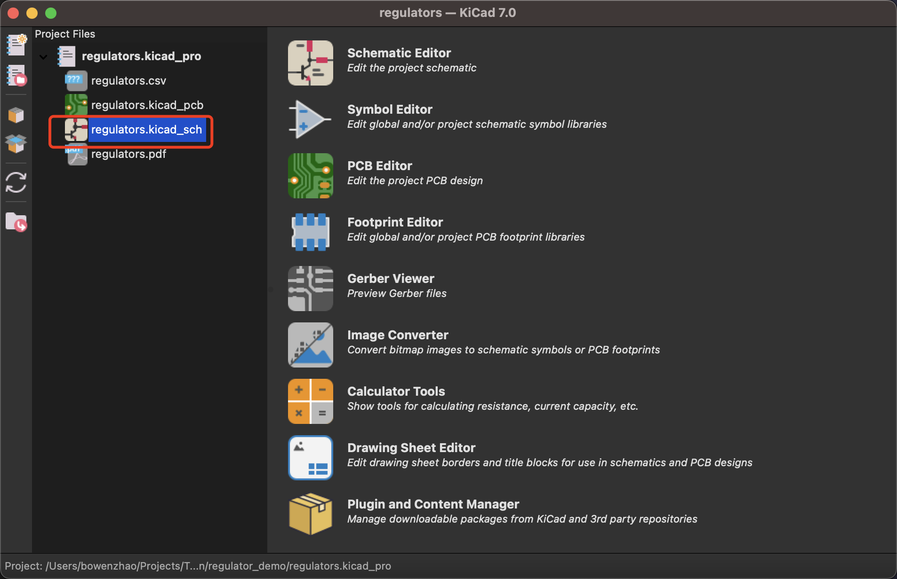
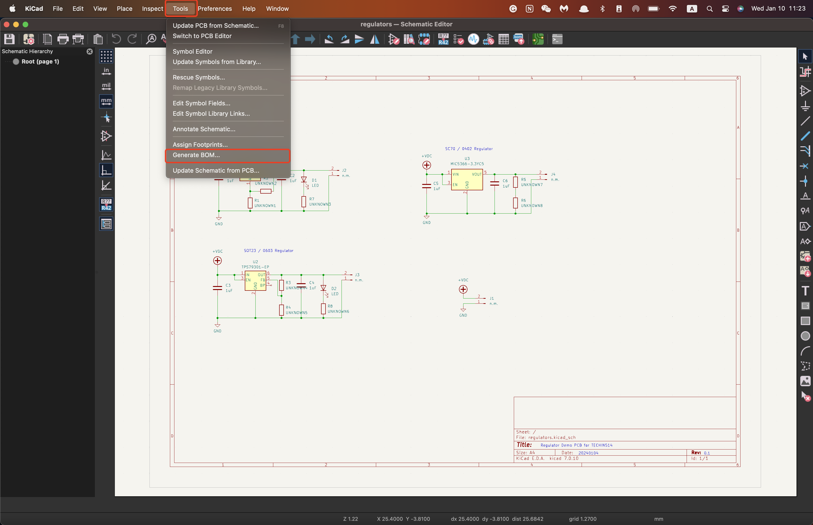
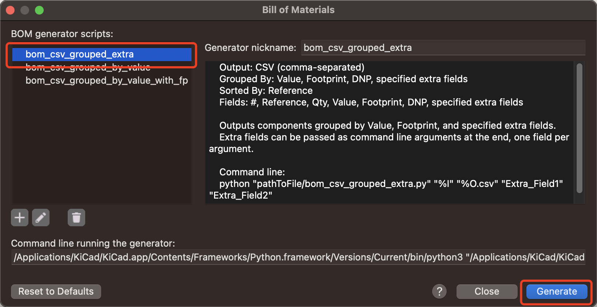
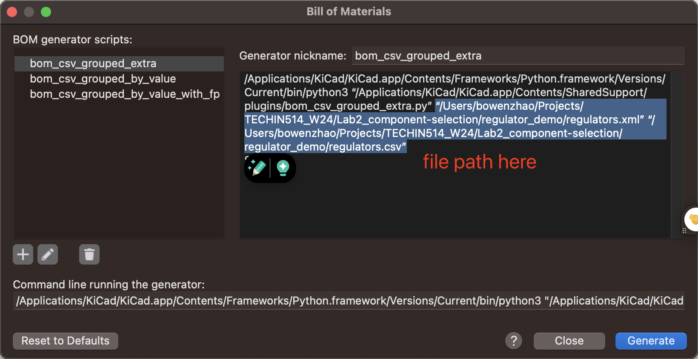
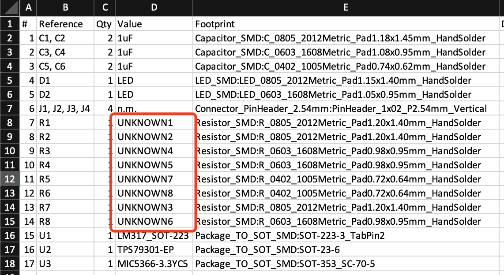
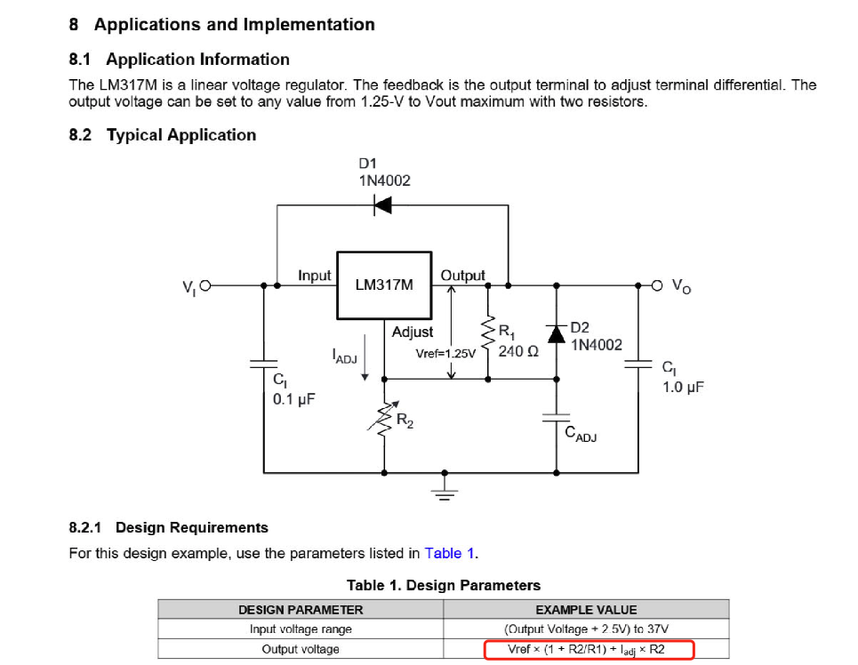

## Lab 2: Component Selection and Surface Mount Soldering

**This lab has two sections: analytical and physical**

## Lab Prerequisites

Before this lab, make sure you have the following ready:

* KiCAD installation on your laptop for PCB design
* **USB-C cable**: Make sure you can connect ESP32 to your laptop

## Section 1: analyse and component selection

The first part is analytical, using the regulators schamtic.

Step 1: Geneate a BOM using KiCAD and save to a CSV

1. Open the file *regulators.kicad_pro* with KiCAD, and double-click the _sch tab

   
2. Then click Tool -> Generate BOM to generate the spreadsheet:

   
3. Select *bom_csv_grouped_extra* on the left then click *Generate
   *
4. The file should appear under the same directory as the schematic file, showing on the screen
   
5. Open the CSV file, and fill in all UNKNOWN values based on your calculation mentioned below:
   

Step 2: Datasheet reading, calculation, and component selection

* You'll choose the necessary resistors to adjust output voltage of your regulators and a matching current-limiting resistors for your LEDs.
  * For your regulators, set the first output voltage (VOUT1, on the left) to 2V + 0.01 * the day of the month you were born. So if you were born on the 15th, you should set the voltage to 2.15V;
  * For the second output voltage (VOUT2, in the middle), add 0.1 to the first output voltage. So if you were born on the 15th, set it to 2.25V;
  * For the third output voltage (VOUT3, on the right), set it to the same voltage as VOUT2.

Here's a brief instruction about how to read a datasheet, using the LM317 regulator as an example:

1. Check the Terminal Configuration and Functions to know what pins are for on this device;
2. Check the Speficiations (Specs), especially Absolute Maximum Ratings of the device. This will ensure you won't destroy the device with high voltage/current;
   
3. For regulators, there will be a section of *Application and Implementation* to demonstrate how to assemble it with resistors and capacitors. Typically, there should be an equation about how the output voltage is set: **the selection of the resistors will affect the output voltage**, and this is what your calculation should aim for
   

    There could be other details on the datasheet that might help your component selection. Please check them out carefully.

**For circuits with LEDs and resistors in serial, make sure you select a suitable resistor that will make the current forward (If) in a suitable range.**

# ESP32 Voltage Measurement Exercise
The second part is physical, the goal here is to be familiar with the component packages you might be using in your designs.

## Instructions

### Connect to ESP32 and Read Voltage
- Connect the PCB output to an analog pin on the ESP32.
- Program the ESP32 to read the analog value from this pin.
- It's acceptable for some boards to be non-functional or read zero volts.

### Convert ADC Values to Voltage
- The ESP32 ADC provides values between 0 and 4095. Convert these to voltage readings.
- Use the formula: `Voltage = (ADC_Value / 4095.0) * 3.3` to convert the ADC readings to volts.
- Display the voltage readings in the serial monitor.

## Additional Resources
- You can refer to this blog as reference to calculate voltage from ADC [Random Nerd Tutorials - ESP32 ADC Analog Read](https://randomnerdtutorials.com/esp32-adc-analog-read-arduino-ide/).

## Safety Note
Always double-check connections and voltages with a multimeter before connecting your ESP32 to avoid potential damage.

